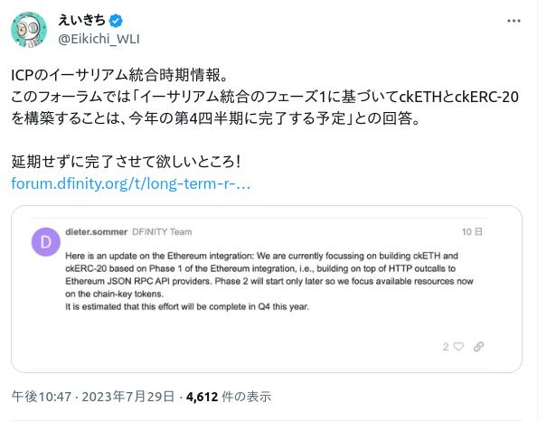
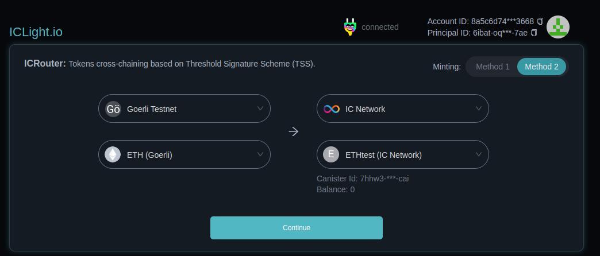

# Ethereum インテグレーションの仕組みとロードマップ

---

# ICP for Ethereum


---


---


---


---


---

## Dfinityが考える現在のEthereumの問題

- Ethereum上のDappのフロントエンドが中央集権組織であるAWSやCloudflareにホスティングされている
   - それにより対検閲耐性がない
- メタバースやGameFiと言われるものが中央集権組織であるAWSやGCPにホスティングされている
  - 開発者がバックドアを仕込んだり、データベースにアクセスして恣意的にデータを変更できる
- Dapp開発のガバナンスが分散化していない
  - ユーザーの意思とは異なるアップデートが追加される恐れがある
- オンチェーンでのデータ取得が中央集権的なオラクルに依存している
- オンチェーン情報の取得が中央集権的なクラウド、またはInfuraのようなサービス提供者に依存している


---

## Ethereum上のDappのフロントエンドが中央集権組織であるAWSやCloudflareにホスティングされている
## →ICP上に静的サイトをホスティングする

---

### Uniswap on ICP


---

カスタムドメインを設定することもできる


---

## メタバースやGameFiと言われるものが中央集権組織であるAWSやGCPにホスティングされている
## →メタバース on ICP

---


---

## Dapp開発のガバナンスが真に民主的になっていない
## →サービスナーバスシステムによるガバナンスの分散化

---

## オンチェーンでのデータ取得が中央集権的なオラクルに依存している
## オンチェーン情報の取得が中央集権的なクラウド、またはInfuraのようなサービス提供者に依存している

## →分散型オラクル on ICP

---

## Orally


---

## Chainsight


---


---


---

# Ethereum統合

---

## Ethereum インテグレーションとは何か？

- 1. プロトコルレベルの統合
   - 1. フェーズ1
      - HTTPアウトコールの技術を使って、ICP上のキャニスターからEthereumの既存のRPCサーバーに対して通信する
   - 2. フェーズ2
      - ICP上にEthereumのフルノードとRPCサーバーを立て、これらのサブネットとキャニスターが通信する
- 2. ckETH & ckERC20
   - 分散化され、暗号学的に安全なブリッジをICP上に作り、ICPにEthereumの資産を持ち込む
- 3. EVM on ICP
   - ICP上でEVMが動くようにする

---
プロトコルレベルの統合-フェーズ1については、2023年中での完了を目指して頑張っているよう



---

# ckETH & ckERC20

---

## ICPの仕組み

- 1つのサーバー → ノード
- ノードをネットワークで繋げたもの → サブネット
- サブネットは世界中にたくさんある
- キャニスターはサブネットにデプロイされる

---


---

## Chain Keyの仕組み

- ノードは秘密鍵の破片を持つ
- サブネットは一つの公開鍵を持つ
- キャニスターはサブネット内の複数のノードで実行される
- 複数のノードが同じ実行結果になると、それぞれのノードで秘密鍵の破片で署名をする（しきい値署名）
- サブネットの公開鍵で署名を検証できる

---


---

## Chain key TXの仕組み

- ICPのサブネットがICPの秘密鍵・公開鍵と、ETHの秘密鍵・公開鍵の両方を持つ
- ICPのキャニスターはEAOのウォレットとして、署名付きトランザクションを作ることができる

---


---

## ETHのスマートコントラクトのブリッジ
- スマートコントラクト & リレイヤー
  - ハッキングが起きがち
- サーバー上のアプリケーション & ウォレット
  - 誰かが秘密鍵を知れる?マルチシグされていればいいが…


## ICP上のブリッジキャニスター
- 秘密鍵が絶対にノードに分散されているので安全
- ただのEOAのウォレットなのでスマートコントラクト起因のハッキングは起きない

## →ETHとICP間の交換に安全なブリッジが作れる

---

## IC Light House
- 板取引を行えるICDex
- エクスプローラーであるICHouse
- ThirdWebのようにノーコードでトークン発行ができるicTokens

---


---


---


---
## icETHの進捗


---



---


---


---


---


---


## EVM on ICP by Bitfinity

- ブロックタイムが1秒
- ファイナリティが2秒
- トランザクションコストは0.02ドル

---

```
RPC URL
https://testnet.bitfinity.network/

Chain ID
355113

Currency Symbol
BFT

Block Explorer URL
https://explorer.bitfinity.network/
```

---

## Chapswap on Bitfinity


---


---

全てをSolidityでやろうとするのではなく…

||データベース操作|アプリケーション開発|
|---|---|---|
|既存金融|COBOL|Java|
|Web2|SQL(RDB)|PHP/Ruby/Python/TS...|
|Web3|Solidity(ETH)|WASM(ICP)|

---

## お前誰よ？


